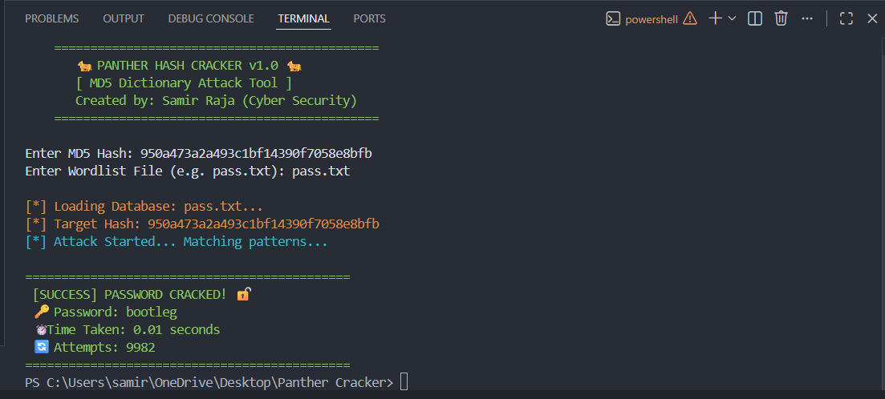

# 🐆 Panther Hash Cracker
### Advanced MD5 Dictionary Attack Tool


## 🔍 Project Overview
**Panther Hash Cracker** is a custom-built Python tool designed to perform **Dictionary Attacks** on MD5 hashes. Unlike simple scripts, this tool includes custom error handling, a visual banner, and real-time attack simulation.

This project demonstrates the importance of **Strong Passwords** by showing how easily weak passwords (like `password123`) can be cracked in **0.0 seconds**.

---

## 📸 Proof of Concept (POC)


---

## ⚡ Features
* ✅ **MD5 Hash Support:** Instantly identifies and cracks MD5 hashes.
* ✅ **Custom Wordlist:** Works with any user-defined dictionary file (`.txt`).
* ✅ **Error Handling:** Robust coding to prevent crashes on missing files.
* ✅ **Hacker-Style UI:** Features `Colorama` based colored terminal output.

## 🛠️ How It Works (The Logic)
1.  **Input:** The user provides a target Hash and a Wordlist file.
2.  **Processing:** The script reads passwords line-by-line, converts them to MD5, and compares them with the target.
3.  **Result:** If a match is found, it displays the cracked password and time taken.

## 💻 Usage
```bash
# Step 1: Clone the Tool
git clone [https://github.com/samir07niu/Panther-Hash-Cracker.git](https://github.com/samir07niu/Panther-Hash-Cracker.git)

# Step 2: Run the script
python cracker.py

👨‍💻 Developer
​Developed by: Samir Raja (Cyber Security Analyst)
Connect with me on [https://www.linkedin.com/in/samir-raja-269078392?utm_source=share&utm_campaign=share_via&utm_content=profile&utm_medium=android_app]
